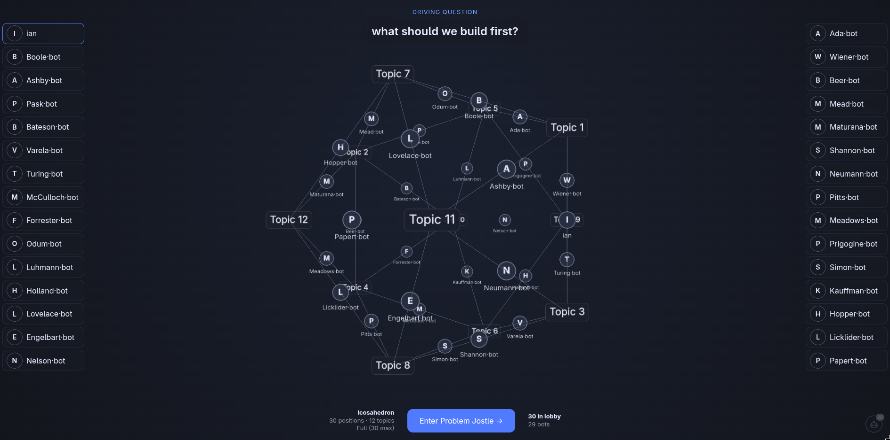

# Syntegrity Web App

A web app that runs **Team Syntegrity**, Stafford Beer's method for getting a group
to think through a hard question together, fairly and without a hierarchy. It is being
built for the [Integral Collective](https://integralcollective.io) so its nodes and
communities can make decisions as a group.

> **Status: work in progress.** 🚧
> The flow is testable end to end from starting a session up to **topic and role
> assignment** (everyone gets matched to the topics they care about and shown who
> they work with). The actual **group discussion rounds come next** and are not built
> yet. Things will change.



## What is Team Syntegrity?

Instead of one person setting the agenda, the group surfaces its own. Everyone is given
an equal place in a geometric shape (a polyhedron), and that shape decides, fairly, who
discusses what and who critiques what. It is designed so good ideas can't get buried and
no single voice dominates. The number of people sets the shape:

- **6 people** → tetrahedron (4 topics)
- **12 people** → octahedron (6 topics)
- **30 people** → icosahedron (12 topics, the classic form)

## How a session flows

You start a session around one **driving question**, invite people with a link, and the
group works through these steps. Steps 1 to 7 are built and being tested; the discussion
steps after that are pending.

1. **Initiate** - set the driving question, get an invite link. ✅ *claude built, human refined*
2. **Profile** - add your name and a photo. ✅ *claude built, human refined*
3. **Lobby** - a rotating 3D shape that grows as people join. ✅ *claude built, human refined*
4. **Problem Jostle** - everyone posts statements; the app clusters them into themes live. ✅ *claude built, human working on now*
5. **Voting** - each person spends 5 votes to pick the topics that matter most. ⏳ *claude built, waiting for human to test and improve*
6. **Topic Preference** - rank the winning topics in the order you'd like to work on them. ⏳ *claude built, waiting for human to test and improve*
7. **Syntegrity Graph** - everyone is matched to topics (as a contributor and as a critic) ⏳ *claude built, waiting for human to test and improve*
   and shown their meeting schedule. ⏳ *claude built, waiting for human to test and improve*
8. **Discussion rounds** - the actual team conversations (three rounds), shared statements,
   and final outcomes. 🚧 *Not yet built, or defined*

## Testing it solo

You don't need a room full of people to try it. In the lobby there's a small **bot button**
(bottom right). Each click adds an AI participant that fills a spot and takes part at every
step on its own (posting statements, voting, ranking). Bots are briefed on the Integral
Collective so they contribute sensibly. Add enough to fill a shape and you can walk the
whole flow yourself.

The bots (and the live theme clustering) run on a language model through
[OpenRouter](https://openrouter.ai), so you'll need an OpenRouter API key set in `.env`
(see below) for them to work. The model is cheap by default, but it does cost a little per run.

## Running it locally

You'll need Node, a free Supabase project (the backend), and an OpenRouter key (for the
AI bits). Short version:

```bash
npm install
npm run dev        # opens http://localhost:5173
```

Create a `.env` file in the project root with these three values, or copy and rename `.env.example`:

```bash
VITE_SUPABASE_URL=...              # your Supabase project URL
VITE_SUPABASE_PUBLISHABLE_KEY=...  # your Supabase publishable (anon) key
VITE_OPENROUTER_API_KEY=...        # your OpenRouter key, for bots + clustering
```

You also need to create the database tables once. The full, step-by-step setup (including
the database) is in **[SETUP.md](./SETUP.md)**.

## For developers

Files are numbered by the step they belong to so you can jump straight to a part of the
process: a leading number (like `4-ProblemJostle.vue` or `4-clustering.ts`) means it
belongs to step 4, and no number means it's shared across steps. Built with Vue 3,
Supabase (live multiplayer), and three.js (the 3D shape). The Syntegrity maths
(geometry, matching, scheduling) lives in `src/util/`.

### Jumping straight to a step (`?phase=`)

Normally the step you see is driven by the session's `phase` in the database. For
testing you can force a specific step's view with a `?phase=` query param on a session
URL — it's read-only and does **not** change the real phase in the database:

```
/s/<sessionId>?phase=graph
```

| Step | `?phase=` value | View |
| ---- | --------------- | ---- |
| 3. Lobby | `lobby` (or `reconciliation`) | `3-Lobby.vue` |
| 4. Problem Jostle | `jostle` | `4-ProblemJostle.vue` |
| 5. Voting | `voting` | `5-Voting.vue` |
| 6. Topic Preference | `preference` | `6-TopicPreference.vue` |
| 7. Syntegrity Graph | `graph` (or `done`) | `7-SyntegrityGraph.vue` |

Steps 1 (Initiate) and 2 (Profile) are their own routes, not phases, so the override
doesn't apply to them. A step only renders meaningfully if the session already has the
data that step needs (e.g. `?phase=graph` needs voting/preference data to compute the
assignment), so point it at a session that's progressed far enough.
